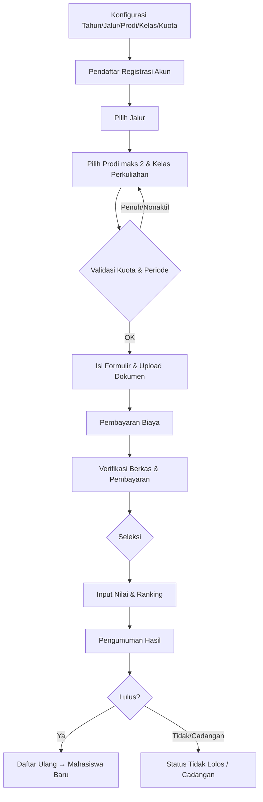

# PRD — Sistem PMB (Penerimaan Mahasiswa Baru)

> Dokumen: Product Requirements Document
> Versi: 1.0 (Draft)
> Status: Menunggu review & persetujuan stakeholder
> Tanggal: 2026-08-13

---

## 1. Ringkasan Eksekutif

Sistem PMB adalah aplikasi web untuk mengelola seluruh siklus **Penerimaan Mahasiswa Baru** secara terpusat dan profesional. Sistem mendukung **multi-tahun penerimaan**, **multi-jalur penerimaan**, **multi-program studi (prodi)**, **multi-kelas**, serta pengaturan **kuota** yang fleksibel per kombinasi. Sistem dirancang agar **konfiguratif** (tidak perlu mengubah kode saat ada jalur/prodi/kelas baru) dan mengikuti **standar produksi** (keamanan, audit, skalabilitas, dan maintainability).

### Tujuan
1. Menyediakan satu pintu terpadu untuk pendaftaran dan seleksi mahasiswa baru.
2. Memungkinkan panitia mengatur tahun, jalur, kuota, prodi, kelas, biaya, dan persyaratan tanpa perubahan kode.
3. Menjamin data pendaftar akurat, terlacak (audit), dan aman.
4. Menyediakan dashboard & laporan real-time untuk pengambilan keputusan.

### Sasaran (Non-fungsional level tinggi)
- Mendukung konfigurasi N tahun, N jalur, N prodi, N kelas tanpa perubahan kode.
- Toleransi beban tinggi pada periode puncak pendaftaran.
- RBAC penuh + audit log pada setiap perubahan data penting.

---

## 2. Ruang Lingkup

### In Scope
- Manajemen master data: tahun penerimaan, jalur, prodi, kelas, gelombang, kuota, biaya, persyaratan dokumen.
- Portal pendaftaran untuk calon mahasiswa (register, isi formulir, upload dokumen, bayar, pantau status, cetak kartu, pengumuman).
- Back-office panitia: verifikasi berkas, validasi pembayaran, penilaian/input nilai seleksi, ranking, kelulusan, pengumuman.
- Dashboard & pelaporan (rekap pendaftar, keterisian kuota, ekspor).
- Pengaturan & audit (roles, permission, log aktivitas).

### Out of Scope (versi ini)
- Integrasi penuh dengan SIAKAD / PDDikti (dapat menjadi modul lanjutan; disiapkan API untuk itu).
- Sistem CBT (Computer-Based Test) penuh — hanya input/manajemen nilai hasil tes.
- Akuntansi/keuangan penuh (hanya pencatatan pembayaran & rekonsiliasi status).
- Aplikasi mobile native (web responsif sebagai prioritas; mobile dapat menyusul).

---

## 3. Pengguna & Peran (Roles)

| Peran | Deskripsi | Akses Utama |
|-------|-----------|-------------|
| **Super Admin** | Administrator sistem tertinggi | Konfigurasi sistem, manajemen user & role, semua menu |
| **Admin PMB (Panitia Pusat)** | Mengelola master data & operasional PMB | Tahun, jalur, prodi, kelas, kuota, gelombang, biaya, pengumuman |
| **Operator Prodi/Fakultas** | Mengelola pendaftar di prodi/unit terkait | Verifikasi berkas, input nilai, melihat pendaftar prodi-nya |
| **Reviewer/Verifikator** | Memverifikasi kelengkapan dokumen | Persetujuan/penolakan berkas pendaftar |
| **Bendahara/Keuangan** | Validasi pembayaran | Rekonsiliasi pembayaran, konfirmasi lunas |
| **Pimpinan (Viewer)** | Melihat laporan & dashboard | Akses baca saja ke dashboard/laporan |
| **Calon Mahasiswa (Pendaftar)** | Mendaftar & memantau status | Registrasi, formulir, upload, pembayaran, cetak kartu |

---

## 4. Persyaratan Fungsional (Functional Requirements)

### 4.1 Konfigurasi & Master Data

#### 4.1.1 Tahun Penerimaan
- Admin dapat membuat **Tahun Penerimaan** (mis. `2026/2027`).
- Atribut: kode, nama, status (draft/aktif/ditutup/arsip), rentang tanggal periode.
- Beberapa tahun dapat aktif berdampingan (arsip tahun lama tetap bisa dibaca).
- **Aturan**: pendaftar hanya bisa mendaftar ke tahun yang berstatus `aktif`.

#### 4.1.2 Jalur Penerimaan
- Admin dapat membuat **Jalur Penerimaan** (mis. `Jalur Reguler`, `Jalur RPL`).
- Atribut: kode, nama, kategori (nasional/mandiri), urutan tampil, status aktif.
- Setiap jalur dapat memiliki **biaya pendaftaran**, **persyaratan dokumen**, **timeline**, dan **metode seleksi** tersendiri.

#### 4.1.3 Program Studi (Prodi)
- Admin dapat membuat **Prodi** (mis. `Teknik Informatika`, `Manajemen`, dst.).
- Atribut: kode, nama, jenjang (D3/D4/S1/S2), fakultas/unit, status aktif.
- Relasi ke fakultas (opsional) untuk pembagian tugas operator.

#### 4.1.4 Kelas Perkuliahan
- Admin dapat membuat **Kelas Perkuliahan** (mis. `Reguler A`, `Reguler B`, `Kelas Karyawan`).
- Atribut: kode, nama, status aktif.

#### 4.1.5 Setting Prodi (inti fleksibilitas)
- **Untuk setiap Prodi**, admin menentukan:
  - **Kelas apa saja** yang tersedia di prodi tersebut.
  - **Jalur apa saja** yang tersedia di prodi tersebut.
- Konfigurasi ini berbentuk **matriks Prodi × Kelas × Jalur**.
- Contoh: Prodi Teknik Informatika memiliki Kelas Reguler A & B (jalur Reguler) dan Kelas Karyawan (jalur RPL).

#### 4.1.6 Kuota Prodi
- Admin menetapkan **kuota per Prodi** (opsional diperinci per **Jalur** dan/atau **Kelas Perkuliahan**).
- Atribut: jumlah kuota, kuota terpakai (dihitung otomatis), status buka/tutup.
- **Aturan bisnis**:
  - Kuota terpakai tidak boleh melebihi kuota (validasi saat pendaftaran).
  - Saat kuota penuh, prodi/jalur/kelas otomatis "penuh" dan tidak dapat dipilih (atau masuk waiting list, opsional).

#### 4.1.7 Gelombang
- Admin dapat membuat **Gelombang** (1, 2, 3) per tahun.
- Atribut: nama, rentang tanggal pendaftaran, rentang tanggal seleksi/pengumuman.
- Kuota dan biaya dapat dibedakan per gelombang.

#### 4.1.8 Biaya Pendaftaran
- Biaya formulir/pendaftaran ditentukan per **Jalur** (opsional per Gelombang).
- Mendukung jumlah nominal dan kode akun/VA untuk pembayaran.

#### 4.1.9 Persyaratan Dokumen
- Admin menentukan daftar dokumen wajib/tambahan per **Jalur** dan/atau **Prodi**.
- Contoh dokumen: ijazah/rapor, KTP, pas foto, surat keterangan lulus, sertifikat prestasi, KIP-K, dll.

### 4.2 Pendaftaran (Portal Calon Mahasiswa)

1. **Registrasi akun** — mahasiswa membuat akun (email + password), verifikasi email/OTP.
2. **Pilih jalur** → sistem menampilkan **prodi & kelas perkuliahan yang tersedia** sesuai konfigurasi (matriks).
3. **Pilih prodi** → mahasiswa dapat memilih maksimal **2 (dua) prodi** (pilihan 1 & pilihan 2).
4. **Pilih kelas perkuliahan** (per prodi) → sistem memvalidasi ketersediaan kelas, kuota, & periode.
5. **Isi formulir** — biodata, data orang tua/wali, data sekolah/asal, nilai (rapor/UTBK), prestasi.
6. **Upload dokumen** sesuai persyaratan jalur/prodi.
7. **Pembayaran biaya pendaftaran** — menghasilkan kode bayar (VA/QRIS); status lunas setelah dikonfirmasi (gateway/verifikator).
8. **Submit final** → sistem membuat **Nomor Pendaftaran** unik.
9. **Pantau status** — pendaftar melihat progress: `draft → terverifikasi → lolos seleksi → daftar ulang`.
10. **Cetak kartu peserta** (PDF).

### 4.3 Seleksi & Penilaian

- Panitia/operator dapat **menginput nilai/hasil seleksi** per pendaftar (nilai tes, skor prestasi, dsb.).
- Mendukung **skema seleksi** per jalur (tes, prestasi/berkas, rapor, atau kombinasi) dengan bobot nilai.
- Sistem menghitung **skor akhir** dan **peringkat (ranking)** per jalur/prodi/kelas.
- Kuota + ranking menentukan **status kelulusan** (diterima/cadangan/tidak lolos).

### 4.4 Pengumuman & Daftar Ulang

- Admin menerbitkan **pengumuman** hasil seleksi (per jalur/gelombang), dengan akses publik/terbatas.
- Pendaftar melihat status kelulusan & dapat **mencetak surat kelulusan**.
- Pendaftar yang lolos melakukan **daftar ulang** (upload bukti, konfirmasi) hingga status berubah menjadi `registrasi/mahasiswa baru`.

### 4.5 Dashboard & Laporan

- **Dashboard real-time**: jumlah pendaftar per jalur/prodi/kelas, keterisian kuota, tren harian.
- **Laporan** (filter per tahun/jalur/prodi/kelas/gelombang):
  - Rekap pendaftar, rekap pembayaran, rekap kelulusan.
  - Ekspor ke **Excel/CSV** dan **PDF**.

### 4.6 Pengaturan & Audit

- Manajemen user & role (RBAC) dengan permission granular.
- **Audit log** mencatat siapa melakukan apa & kapan (create/update/delete data master, verifikasi, kelulusan).
- Pengaturan umum (nama institusi, logo, teks pengumuman, dll.).

---

## 5. Persyaratan Non-Fungsional (Non-Functional Requirements)

| Aspek | Persyaratan |
|-------|-------------|
| **Keamanan** | RBAC, autentikasi aman, hash password, proteksi CSRF/XSS/SQLi, enkripsi data sensitif, audit log |
| **Performa** | Halaman utama & form responsif (< 2 detik); mampu menangani lonjakan trafik periode pendaftaran |
| **Skalabilitas** | Arsitektur modular; dapat menambah jalur/prodi/kelas tanpa kode; siap multi-instance/horizontal scale |
| **Ketersediaan** | Uptime tinggi pada periode kritis; mekanisme backup & restore |
| **Usability** | UI responsif (desktop & mobile), bahasa Indonesia, UX sederhana untuk pendaftar awam |
| **Maintainability** | Kode terstruktur, konfigurasi terpisah dari kode, dokumentasi |
| **Integrasi** | API untuk payment gateway, SIAKAD/PDDikti (masa depan), notifikasi (email/WA) |
| **Kepatuhan** | Sesuai aturan seleksi nasional & perlindungan data pribadi |

---

## 6. Aturan Bisnis (Business Rules) Utama

1. Pendaftar hanya dapat memilih kombinasi prodi/kelas/jalur yang **dikonfigurasi tersedia**.
2. Pendaftar dapat memilih **maksimal 2 (dua) prodi** (pilihan 1 & pilihan 2) dalam satu pendaftaran.
3. Pendaftaran hanya berlaku pada tahun & gelombang berstatus **aktif** dan dalam rentang tanggal.
4. **Kuota terpakai tidak boleh melebihi kuota**; kombinasi penuh otomatis ditutup.
5. Pendaftaran dianggap sah setelah **pembayaran lunas + berkas terverifikasi** (tergantung kebijakan jalur).
6. Kelulusan dihitung dari **ranking × kuota** per jalur/prodi/kelas/gelombang.
7. Setiap perubahan data master/verifikasi/kelulusan tercatat di **audit log**.
8. Nomor pendaftaran unik dan tidak dapat diubah.

---

## 7. Model Data (Ringkasan Entitas)

```
users (id, role, ...)
roles / permissions
tahun_penerimaan (kode, nama, status, tanggal)
jalur (kode, nama, kategori, biaya, status)
prodi (kode, nama, jenjang, fakultas, status)
kelas_perkuliahan (kode, nama, status)
gelombang (nama, tanggal_pendaftaran, tanggal_seleksi, tanggal_pengumuman)
prodi_kelas_jalur (prodi_id, kelas_id, jalur_id)          -- matriks setting prodi
kuota (tahun_id, jalur_id, prodi_id, kelas_id, gelombang_id, jumlah)  -- kuota prodi
persyaratan_dokumen (jalur_id/prodi_id, dokumen, wajib)
pendaftar (user_id, biodata, sekolah, kontak)
pendaftaran (tahun, jalur, gelombang, nomor_pendaftaran, status)
pendaftaran_prodi (pendaftaran_id, urutan [1|2], prodi_id, kelas_id, status)  -- maks 2 pilihan prodi
pembayaran (pendaftaran_id, nominal, kode_bayar, status, tgl_bayar)
dokumen_pendaftar (pendaftaran_id, jenis, file, status_verifikasi)
nilai_seleksi (pendaftaran_id, komponen, nilai)
hasil_seleksi (pendaftaran_id, skor, ranking, status_kelulusan)
pengumuman (jalur_id, gelombang_id, judul, isi, tgl_terbit)
audit_log (user_id, aksi, entitas, data_lama, data_baru, waktu)
```

---

## 8. Alur Proses (Workflow)



---

## 9. Kriteria Penerimaan (Acceptance Criteria) Ringkas

- Admin dapat menambah tahun/jalur/prodi/kelas/gelombang dan menetapkan kuota **tanpa perubahan kode**.
- Pendaftar hanya melihat pilihan prodi/kelas/jalur yang tersedia sesuai konfigurasi.
- Pendaftar dapat memilih maksimal 2 (dua) prodi (pilihan 1 & pilihan 2) dalam satu pendaftaran.
- Kuota terpakai ter-update real-time dan mencegah over-booking.
- Nomor pendaftaran unik diterbitkan setelah submit.
- Status pembayaran & verifikasi tercermin akurat ke dashboard.
- Ranking & kelulusan sesuai kuota per kombinasi.
- Laporan dapat diekspor Excel/PDF.
- Semua aksi penting tercatat di audit log.

---

## 10. Asumsi & Pertanyaan Terbuka

**Asumsi saat ini (perlu konfirmasi):**
- Satu institusi/PT (bukan multi-tenant antar kampus), tetapi multi-tahun.
- Teknologi target: web dengan framework **Laravel 13** (lingkungan `Herd`), database **MariaDB**.
- Pembayaran via payment gateway (VA/QRIS) dengan dukungan konfirmasi manual sebagai fallback.

**Pertanyaan terbuka:**
1. Apakah perlu **waiting list** saat kuota penuh, atau langsung tutup?
2. Jalur nasional diintegrasikan dengan sistem eksternal, atau input manual?
3. Dokumen & biaya persyaratan — perlu **template dokumen dinamis** (upload jenis apa saja), atau daftar tetap?
4. Apakah nilai seleksi diinput manual, impor Excel, atau ada modul CBT?
5. Notifikasi yang diinginkan: email, WhatsApp, keduanya?
6. Apakah ada kebutuhan **multi-gelombang paralel** atau hanya satu gelombang per jalur?
7. Skala perkiraan: jumlah prodi, jalur, dan pendaftar (untuk sizing infrastruktur)?

---

## 11. Milestone Usulan (Opsional)

1. **M1** — Master data & konfigurasi (tahun, jalur, prodi, kelas, kuota, matriks setting).
2. **M2** — Portal pendaftaran (registrasi, formulir, upload, pembayaran, status, cetak kartu).
3. **M3** — Back-office (verifikasi, pembayaran, nilai, ranking, kelulusan, pengumuman).
4. **M4** — Dashboard, laporan, ekspor.
5. **M5** — Hardening (keamanan, audit, performa, backup) & UAT.
